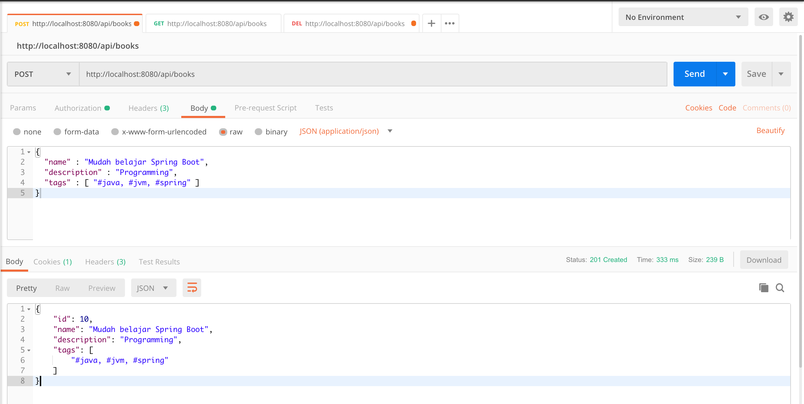
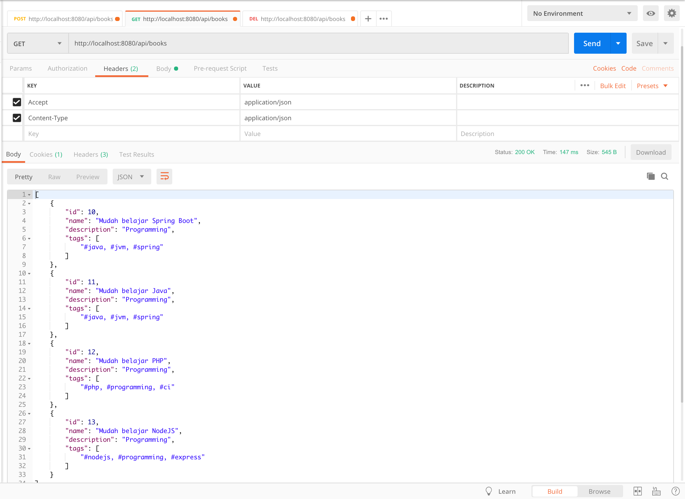
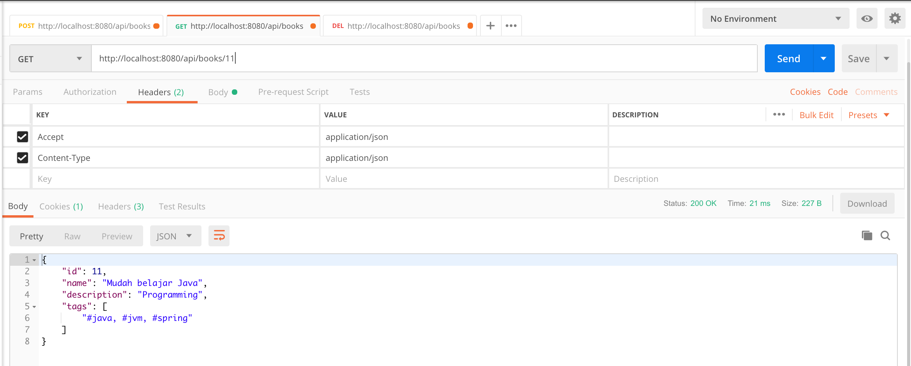

#Task 1:  Creation of a repository on Github

#Task 2:   Building a Spring Boot REST API project 
Adding an entity Author, a repository interface AuthorRepository, and a controller AuthorRestController. 

##Testing using Postman: 

#Task 3: Building and pushing to DockerHub: 

# spring-boot-rest-api-postgresql

#### Plain REST API CRUD with Spring Boot and PostgreSQL.

Technology stack:

* Spring Boot;
* Spring Web;
* Spring Data;
* PostgreSQL database;
* Hibernate;
* Spring Security (as basic authentication).

##### To run this application use:

`mvn clean spring-boot:run`

The view in the Postman:

Add new Book

`POST /api/books`

http://localhost:8080/api/books

Get All Books

`GET /api/books`

http://localhost:8080/api/books

Get Book By Id

`GET /api/books/{id}`

http://localhost:8080/api/books/{id}

Get Book By Name

`GET /api/books?name=name`

http://localhost:8080/api/books?name=name

Delete Book By Id

`DELETE /api/books/{id}`

http://localhost:8080/api/books/{id}

Delete All Books

`DELETE /api/books`

http://localhost:8080/api/books

/////////////

kubectl config current-context -- To view your current context
kubectl config get-contexts -- To list all your contexts
kubectl config use-context my-context -- To switch to a different context:
